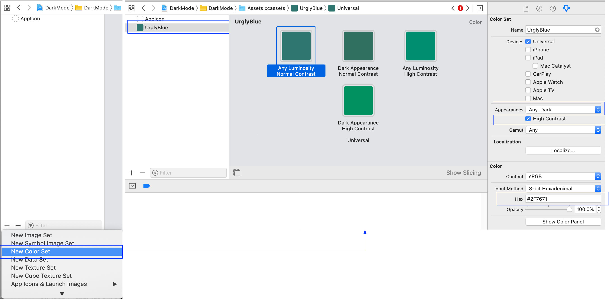

# IOS Dark Mode

#### 1. What's Dark Mode? 

​	Dark mode changes the typical bright theme to a darker one, which can be easier on the eyes, particularly at night. 

#### 2. How to enable Dark Mode on your device? 

+ Prepare a IOS13 device 

  ​	Devices with system version earlier IOS13 does not support Dard Mode.

+ Open "Settings" -> "Display & Brightness" 

  ​	Click the "Dark" button to change appearance from light to dark, You can set dark mode to turn on and off automatically at certain times, or at sunset and sunrise.

  

  

#### 3. Do you want your app running in Mark Mode?

+ Build your app with XCode11

     ​	If your app build with Xcode10 or earlier,  even you enabled Dark Mode on devices with Dark Mode enabled, your app will still display its normal appearance.

+ Prepare a IOS13 device and change your device to Dark Mode(Refer to part 2), then open your app.

  Cool:  

  ​	Whenever Dark Mode is enabled, your app UI will automatically switch appearance, system do it for us, we get a lot of work done for free.

  Sad:  

  ​	Some of your app UI will certainly look weird, probably with bright shiny colors, even in this new appearance. This would be a really bad experience for your users.  How to avoid? (refer to part 4).
#### 4. How to avoid your app UI look weird? 

+ Method 1: 

  ​	 Keep shipping your app with Xcode 10.

 + Method 2:  

  ​	add a new key "UIUserInterfaceStyle" in your app "info.plist" and set its value to "Light".

  

  	And then build your app, you app apperence would be like bellow(even you enabled Dark Mode on devices with Dark Mode enabled, your app will still display its normal appearance):

​	Important Notes: even you force dark mode disabled, the system popup dialog in your app will still 

  

#### 5. what you can do if you want your project to support Dark Mode?   

​	First of all, you should be more familiar with the system behavior and design, make your app be more native, 	"Do what apple want you do" is very important,  system encourage us to do like that.  It is very helpfull for us, we get a lot of work done for free, because system do a lot of work for us.

##### 5.1 Static Colors:
  	 IOS12 or lower offers us a few simple colors like .black, .darkGray....., these colorss are static,  which means their tint never changes. 
##### 5.2 Dynamic Colors:
​	IOS13 offers us a few simple system colors, like .systemRed, .systemGreen....., these colors are dynamic colors, which means their tint will adapt to the current system interface.By using these dynamic colors, your interface will automatically pick the right tint for the current system preference, no further work required!  

​	Semantic Colors: these colors names are based on their intended usage. Semantic colors ensure that your app has a similar appearance to the rest of the system. By using these, your app will feel native, which is always the best experience for the user.  


##### 5.3  how to create custom dynamic colors?

+ Method1:  Assets Catalog（ not recommended, Apple recommend you to use System and Semantic Colors as much as possible）

  ​	For Example:  Click "+" -> Click "New Color Set" -> Add a Color "UrglyBlue" to your assets catalog -> set its appearances to "Any, Dark" -> Enable "High Contrast" , great , three new color boxes will appear, Set each variant to its appropriate tint. refer to bellow image.

  ​	when ever you want to use, just call "UIColor(named: "UrglyBlue") ".

  

+ Method2:  In Code

  ​	IOS10 or lower doesn't support colors declarations in the asset catalog, so if your project are targeting IOS10 or don't want to use method1, you can choose to use this method (recommend you to drop target IOS10, choose target IOS11 or above).
```
extension UIColor {
	let dynamicColor = UIColor { (traitCollection: UITraitCollection) -> UIColor in
    	switch traitCollection.userInterfaceStyle {
    	case
      	.unspecified,
      	.light: return .white
    	case .dark: return .black
    	}
	}
}
```

##### 5.4 Compatibility(Important!!!)

​	IOS13 new added colors are all well and good, but most of us with existing apps will still be supporting devices with iOS 12 or lower, at least for a while. This means we'll probably be doing a lot of things like this, using Swift's `#available` syntax:

```
if #available(iOS 13, *) {
    label.textColor = .label
} else {
    label.textColor = .black
}
```

​	It's a workable solution, but it necessitates changing a lot of code. I wondered if there was a better way. What if, instead of the `if #available`, there was a way to abstract the color choice down one level, so we could do something like this?

```
enum ColorCompatibility {
	//System Color
    static var label: UIColor {
        if #available(iOS 13, *) {
            return .label
        }
        return UIColor(red: 0.0, green: 0.0, blue: 0.0, alpha: 1.0)
    }
    .......
    
    //Custom Color
    static var UrglyBlue = UIColor(named: "UrglyBlue") 
    
    ........
}
label.textColor = ColorCompatibility.label
```

Advantages:

+ This code will compile on iOS 13+, iOS 12 and earlier
+ Since everything is a computed var, we never pre-store colors, which means that when the user switches color scheme, our app will automatically adapt as the trait collection changes
+ When we drop iOS 12 support, cleaning this up will be as simple as replacing every instance of `ColorCompatibility` with `UIColor` 

##### 5.5 SF Symbols

​	 SF Symbols provides a set of over 1,500 consistent, highly configurable symbols you can use in your app. Apple designed SF Symbols to integrate seamlessly with the San Francisco system font, so the symbols automatically ensure optical vertical alignment with text for all weights and sizes. You can use SF Symbols in apps running in iOS 13 and later, watchOS 6 and later, and tvOS 13 and later.

- Advantages：

  - automatically look great in Dark Mode, and full-color images that are optimized for both light and dark appearances. 
  - SF Symbols are vector images,which look perfect at any size. they also come built-in with the system: no need to package them up in our app! Yay for smaller app sizes!

- How to use SF Symbols in your project?

  - Storyboard

  you can tell Xcode which symbol to use by typing the correct glyph name in the image name field 

  

  - By Code

```
if #available(iOS 13.0, *) {
	UIImage(systemName: "star.fill")
}
```

- How to create custom symbols?

  ​	If you need a symbol that isn't provided by SF Symbols, you can create your own. The SF Symbols app lets you export a symbol as a template in a reusable, vector-based file format. To create a custom symbol, export an SF symbol that's similar to the design you want and modify the template using a vector-editing tool like Sketch or Illustrator. Use the result in your app as you would use the original template file. See [Symbols for Use As-Is](https://developer.apple.com/design/human-interface-guidelines/sf-symbols/overview/#symbols-for-use-as-is) for a list of symbols that can't be customized. For developer guidance, see [Creating Custom Symbol Images for Your App](https://developer.apple.com/documentation/uikit/uiimage/creating_custom_symbol_images_for_your_app).

- For Designer

  ​	Designer can always export any of the available glyphs (as .svg) from the official [SF Symbols](https://developer.apple.com/design/human-interface-guidelines/sf-symbols/overview/) app and change them to perfectly meet the project needs .

  ​	SF Symbols come in nine weights — from ultralight to black — each of which corresponds to a weight of the San Francisco system font. This correspondence lets you achieve precise weight matching between symbols and adjacent text, while supporting flexibility for different sizes and contexts.

  ​	Each symbol is also available in three scales: small, medium, and large. The scales are defined relative to the cap height of the San Francisco system font. By specifying a scale, you can adjust a symbol's emphasis compared to adjacent text, without disrupting the weight matching with text that uses the same point size.


# will update later……………….


#### 6.  iOS13 viewcontroller presentation style issue

​	UIViewController has a property named "modalPresentationStyle", the default presentation style  is "UIModalPresentationFullScreen" for system version earlier IOS13, but the default presentation style  change to "UIModalPresentationAutomatic"  for IOS13.  If you build your project with xcode11,  you should manually set the presentation style  to "UIModalPresentationFullScreen" to avoid some UI issue.
```
//Swift Code Example

let vc = MyViewController()
vc.modalPresentationStyle = .fullScreen 
self.present(vc, animated: true, completion: nil)

class UITextField {
	@property(nullable,nonatomic,copy)   NSString *placeholder;
	......
}
```


Demo:  https://github.com/Carrie925/DarkModeDemo.git

Refer:  https://developer.apple.com/design/human-interface-guidelines/sf-symbols/overview/

​	     https://developer.apple.com/videos/play/wwdc2019/214/

​             https://developer.apple.com/documentation/uikit/appearance_customization/adopting_ios_dark_mode

Author: Carrie D Wang
